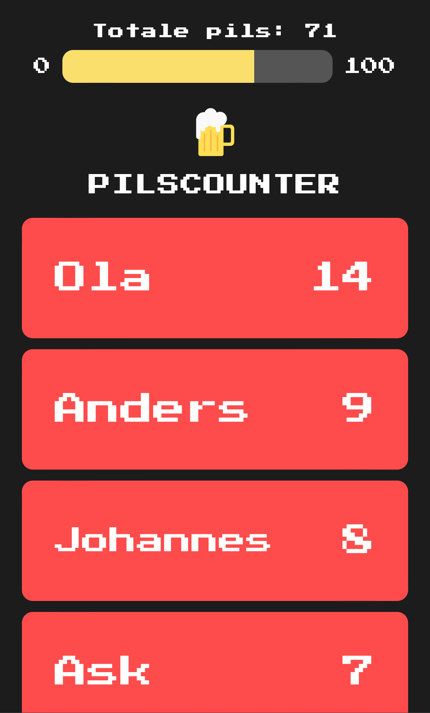
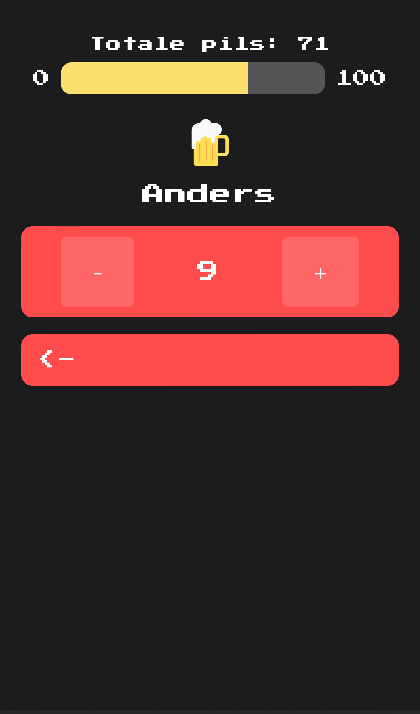

# Pilscounter

Welcome to Pilscounter, the ultimate app to enhance your pre-party (vors) experience! This application is designed to keep track of your drinks and provide a real-time scoreboard that can be displayed on a big screen.

# Screenshots

## Features

- **Mobile-Friendly**: Use Pilscounter on your mobile device for convenience.
- **Real-Time Updates**: The scoreboard updates in real time, ensuring everyone stays informed.
- **Big Screen Display**: Perfect for displaying on a large screen during your party.

## How to Use

1. **Visit the App**: Open your mobile browser and go to [pilscounter.netlify.app](https://pilscounter.netlify.app).
2. **Track Your Drinks**: Use the app to keep track of your drinks.
3. **View the Scoreboard**: For a real-time scoreboard, go to [pilscounter.netlify.app/scoreboard](https://pilscounter.netlify.app/scoreboard) on a big screen.

## Contributing

We welcome contributions! If you have any ideas, suggestions, or bug reports, please feel free to open an issue or submit a pull request.

## Contact

For any inquiries, please contact me at leo.mcgrath@abakus.no

---

Enjoy your party with Pilscounter!
# pilscounter
